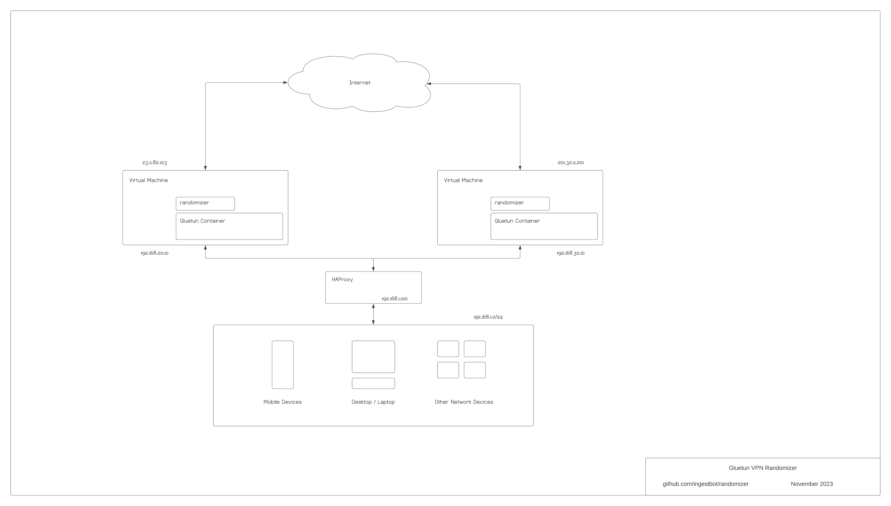

# Gluetun VPN Randomizer 

Gluetun VPN Randomizer is a Python application developed for the purpose of rotating VPN gateways from one or more VPN providers. This will change your outbound 
IP address, and optionally your VPN provider, on a random basis within a given time period (eg, every 2-4 hours). 

Some familiarity with Docker, VPN (Wireguard), and Python may be helpful.

## Requirements and Dependencies

* VPN Service (see [Notes](#notes) for options)
* [Gluetun VPN client](https://github.com/qdm12/gluetun)
* [Docker](https://docs.docker.com/engine/install)
* [Docker Compose V2](https://docs.docker.com/compose/migrate)

* Additional Requirements and Dependencies noted in [randomizer](randomizer)

## Quick Start

* Get a functional [docker-compose.yml](docker-compose.yml) working with Gluetun (see the provided example).
    * eg, `/usr/local/docker/gluetun/docker-compose.yml`
* Modify the provided [env.example](env.example) and copy to the Gluetun path. This provides values to the `environment:` parameters in [docker-compose.yml](docker-compose.yml).
    * eg, `/usr/local/docker/gluetun/.env`
* Create a `gluetun_config` directory. This should be the same path defined in `volumes:`
    * eg, `/usr/local/docker/gluetun/gluetun_config`
* If multiple providers are being used, extensions of `.env` files must be named after [supported Gluetun providers](https://github.com/qdm12/gluetun-wiki/tree/main/setup/providers)
    * eg, `.env.ivpn`, `.env.mullvad`, etc.
* Copy [randomizer](randomizer) to a desired location and make it executable
    * `/usr/local/bin/randomizer`
    * `chmod 750 /usr/local/bin/randomizer`
* Modify `randomizer` options (see [Options](#options) below)
* To run as a systemd service, use the provided systemd unit file [randomizer.service](randomizer.service)
    * `/etc/systemd/system/randomizer.service`
    * `systemctl daemon-reload`
    * `systemctl status|stop|start randomizer`
* Test/Verify Connection:
    * `docker logs gluetun`
    * `curl -x localhost:8008 ipinfo.io`

## Options

Options are defined in a separate YML configuration file (see [randomizer.yml](randomizer.yml). The location of this file is defined in [randomizer](randomizer) by the main parameter `config`.

`debug`: Increases verbosity of logging and frequency of rotation (see also Logging section and `ttime_min`, `ttime_max`)  
`shuffle_vpn_provider`: True to support multiple VPN providers. False if single. Multiple VPN providers require multiple `.env.*` files   
`mqtt_enable`: True to support MQTT.  
`influxdb_enable`: True to support InfluxDB.  
`container_name`: This name should match `container_name` given in `docker-compose.yml`   

## Example Architecture

This is one of many examples of using multiple VPN instances in a given environment.

- LAN: 192.168.1.0/24
    - Consists of a mix of mobile devices, desktops/laptops, and virtual machines
    - All devices in this network use an HTTP/HTTPS proxy of the assigned fronted in HAProxy (eg, 192.168.1.100:8118)
- HAProxy: 192.168.1.100
    - Acts as load balancer and distribution to multiple Gluetun VPN instances
    - In this example port 8118 is the listening HTTP/HTTPS proxy
    - See the configuration example [haproxy.cfg](haproxy/haproxy.cfg)
- Virtual Machines: 192.168.20.10, 192.168.30.10
    - Separate subnets of 192.168.20/24 and 192.168.30/24 are optional
    - Each virtual machine contains a running randomizer and Docker container(s)
    - Outbound IP addresses 23.11.82.103, 201.32.11.201 are randomly assigned based on VPN provider(s) configured in gluetun and frequency of rotation

## DNS

### Unbound

An example of using Gluetun with [Unbound](https://nlnetlabs.nl/projects/unbound/about/) is shown in [/unbound](/unbound)

### Blocky

An example of using Gluetun with [Blocky](https://0xerr0r.github.io/blocky/) is shown in [/blocky](/blocky)

## Notes
- VPN Service: Temporary VPN service can be obtained via https://freevpn.us. See [docker-compose.freevpn.us.yml](docker-compose.freevpn.us.yml) for details.
- Currently, randomizer is biased towards Wireguard. OpenVPN may be supported in the future, particularly if there is a demand for it.
- If multiple VPN instances are being used, it's highly recommended to use MQTT. This prevents conflicting gateways from being used.
- Docker Secrets will be adopted once available https://github.com/qdm12/gluetun/issues/1758
- [VPN Comparison Table](https://www.reddit.com/r/VPN/comments/m736zt/vpn_comparison_table)
